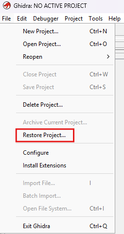
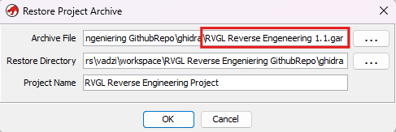
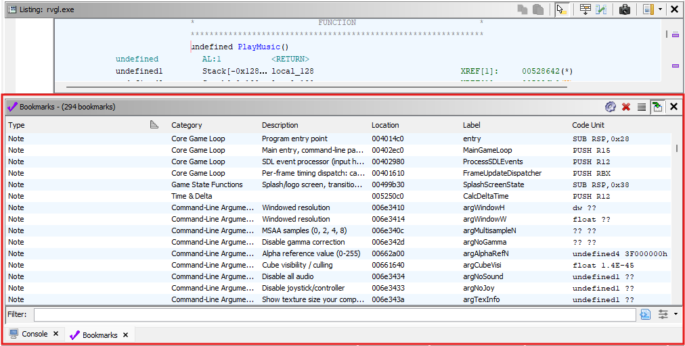

# RVGL Reverse Engineering

This documentation currently targets **win64 23.1030a1**.

[ View Documentation](https://github.com/sinaosal/RVGL-Reverse-Engineering/blob/master/documentation/RVGL%20Unified%20Reverse%20Engineering%20Reference.md)  
[ Download Ghidra Project Archive (.gar)](https://github.com)  
[ View Directly on my website](https://sinaosal.app)

## Contributors

- [sinaosal](https://github.com/sinaosal)
- [HansyRod](https://github.com/HansyRod)

## Contributing

[ View CONTRIBUTING.md](https://github.com/sinaosal/RVGL-Reverse-Engineering/blob/master/CONTRIBUTING.md) to properly contribute to this project!

## Q&A

### How do I load the Ghidra Project Archive (.gar) into Ghidra?

1. **Step 1:** Go to File and click Restore Project.

	

	
Show Step 1 image

	
	

2. **Step 2:** Select your archive file and choose the newest version (currently 1.1).

	

	
Show Step 2 image

	
	

3. **Step 3:** You can now view 250+ bookmarked functions.

	

	
Show Step 3 image

	
	
